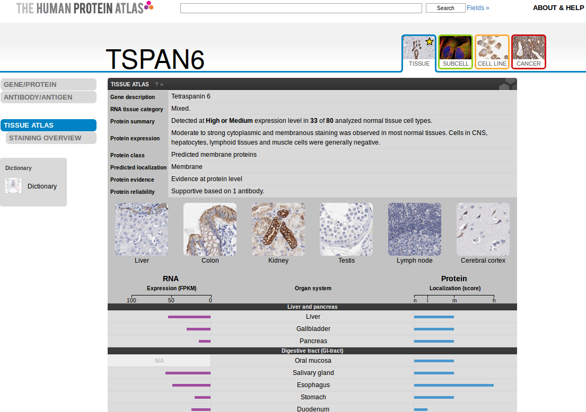

```{r env, echo=FALSE}
suppressPackageStartupMessages(library("BiocStyle"))
suppressPackageStartupMessages(library("org.Hs.eg.db"))
suppressPackageStartupMessages(library("GO.db"))
```


# Introduction

## The HPA project

From the [Human Protein Atlas](http://www.proteinatlas.org/)
[@Uhlen2005; @Uhlen2010] site:


> The Swedish Human Protein Atlas project, funded by the Knut and
> Alice Wallenberg Foundation, has been set up to allow for a
> systematic exploration of the human proteome using Antibody-Based
> Proteomics. This is accomplished by combining high-throughput
> generation of affinity-purified antibodies with protein profiling in
> a multitude of tissues and cells assembled in tissue
> microarrays. Confocal microscopy analysis using human cell lines is
> performed for more detailed protein localisation. The program hosts
> the Human Protein Atlas portal with expression profiles of human
> proteins in tissues and cells.

The `r Biocpkg("hpar")` package provides access to HPA data from the R
interface. It also distributes the following data sets:


- `hpaNormalTissue` *Normal tissue data*: Expression profiles for
  proteins in human tissues based on immunohistochemisty using tissue
  micro arrays. The comma-separated file includes Ensembl gene
  identifier ("Gene"), tissue name ("Tissue"), annotated cell type
  ("Cell type"), expression value ("Level"), the type of annotation
  (annotated protein expression (APE), based on more than one
  antibody, or staining, based on one antibody only) ("Expression
  type"), and the reliability or validation of the expression value
  ("Reliability").}


- `hpaCancer` *Cancer tumor data*: Staining profiles for proteins in
  human tumor tissue based on immunohistochemisty using tissue micro
  arrays. The comma-separated file includes Ensembl gene identifier
  ("Gene"), tumor name ("Tumor"), staining value ("Level"), the number
  of patients that stain for this staining value ("Count patients"),
  the total amount of patients for this tumor type ("Total patients")
  and the type of annotation staining ("Expression type").  }

- `rnaGeneTissue` *RNA gene data*: RNA levels in 45 cell lines and 32
   tissues based on RNA-seq. The comma-separated file includes Ensembl
   gene identifier ("Gene"), analysed sample ("Sample"), fragments per
   kilobase of transcript per million fragments mapped ("Value" and
   "Unit"), and abundance class ("Abundance"). }

- `rnaGeneCellLine` *RNA gene data*: RNA levels in 45 cell lines and
  32 tissues based on RNA-seq. The comma-separated file includes
  Ensembl gene identifier ("Gene"), analysed sample ("Sample"),
  fragments per kilobase of transcript per million fragments mapped
  ("Value" and "Unit"), and abundance class ("Abundance"). }

- `hpaSubcellularLoc` *Subcellular location data*: Subcellular
  localization of proteins based on immunofluorescently stained
  cells. The comma-separated file includes Ensembl gene identifier
  ("Gene"), main subcellular location of the protein ("Main
  location"), other locations ("Other location"), the type of
  annotation (annotated protein expression (APE), based on more than
  one antibody, or staining, based on one antibody only) ("Expression
  type"), and the reliability or validation of the expression value
  ("Reliability"). }

- `hpaSubcellularLoc14` and `*16.1`: Same as above, for versions 14
  and 16.1.

## HPA data usage policy

The use of data and images from the HPA in publications and
presentations is permitted provided that the following conditions are
met:

- The publication and/or presentation are solely for informational and
  non-commercial purposes.
- The source of the data and/or image is referred to the HPA
  site^[www.proteinatlas.org] and/or one or more of our publications
  are cited.


## Installation

 `r Biocpkg("hpar")` is available through the Bioconductor
project. Details about the package and the installation procedure can
be found on its
[landing page](http://bioconductor.org/packages/devel/bioc/html/hpar.html). To
install using the dedicated Bioconductor infrastructure, run :

```{r install, eval = FALSE}
## install BiocManager only one
install.packages("BiocManager")
## install hpar
BiocManager::install("hpar")
```

After installation, `r Biocpkg("hpar")` will have to be explicitly
loaded with

```{r load}
library("hpar")
```

so that all the package's functionality and data is available to the
user.


# The  `r Biocpkg("hpar")`  package

## Data sets

The data sets described above can be loaded with the `data` function,
as illustrated below for `hpaNormalTissue` below. Each data set is a
`data.frame` and can be easily manipulated using standard R
functionality. The code chunk below illustrates some of its
properties.


```{r hpaData}
data(hpaNormalTissue)
dim(hpaNormalTissue)
names(hpaNormalTissue)
## Number of genes
length(unique(hpaNormalTissue$Gene))
## Number of cell types
length(unique(hpaNormalTissue$Cell.type))
head(levels(hpaNormalTissue$Cell.type))
## Number of tissues
length(unique(hpaNormalTissue$Tissue))
head(levels(hpaNormalTissue$Tissue))
```


## HPA interface


The package provides a interface to the HPA data. The `getHpa` allows
to query the data sets described above. It takes three arguments,
`id`, `hpadata` and `type`, that control the query, what data set to
interrogate and how to report results respectively. The HPA data uses
Ensembl gene identifiers and `id` must be a valid
identifier. `hpadata` must be one of available dataset. `type` can be
either `"data"` or `"details"`. The former is the default and returns
a `data.frame` containing the information relevant to `id`. It is also
possible to obtained detailed information, (including cell images) as
web pages, directly from the HPA web page, using `"details"`.

We will illustrate this functionality with using the TSPAN6
(tetraspanin 6) gene (ENSG00000000003) as example.

```{r getHpa}
id <- "ENSG00000000003"
head(getHpa(id, hpadata = "hpaNormalTissue"))
getHpa(id, hpadata = "hpaSubcellularLoc")
head(getHpa(id, hpadata = "rnaGeneCellLine"))
```

If we ask for `"detail"`, a browser page pointing to the
relevant page is open (see figure below)

```{r getHpa2, eval=FALSE}
getHpa(id, type = "details")
```



If a user is interested specifically in one data set, it is possible
to set `hpadata` globally and omit it in `getHpa`. This is done by
setting the `hpar` options `hpardata` with the `setHparOptions`
function. The current default data set can be tested with
`getHparOptions`.

```{r opts}
getHparOptions()
setHparOptions(hpadata = "hpaSubcellularLoc")
getHparOptions()
getHpa(id)
```

## HPA release information

Information about the HPA release used to build the installed


 `r Biocpkg("hpar")` package can be accessed with `getHpaVersion`,
`getHpaDate` and `getHpaEnsembl`. Full release details can be found on
the [HPA release history](http://www.proteinatlas.org/about/releases)
page.

```{r rel}
getHpaVersion()
getHpaDate()
getHpaEnsembl()
```

# A small use case

Let's compare the subcellular localisation annotation obtained from
the HPA subcellular location data set and the information available in
the Bioconductor annotation packages.

```{r uc-hpar}
id <- "ENSG00000001460"
getHpa(id, "hpaSubcellularLoc")
```

Below, we first extract all cellular component GO terms available for
`id` from the `r Biocannopkg("org.Hs.eg.db")` human annotation and
then retrieve their term definitions using the `r Biocannopkg("GO.db")`
database.

```{r uc-db}
library("org.Hs.eg.db")
library("GO.db")
ans <- select(org.Hs.eg.db, keys = id,
              columns = c("ENSEMBL", "GO", "ONTOLOGY"),
              keytype = "ENSEMBL")
ans <- ans[ans$ONTOLOGY == "CC", ]
ans
sapply(as.list(GOTERM[ans$GO]), slot, "Term")
```


# Session information {-}

```{r sessioninfo, echo = FALSE}
sessionInfo()
```
